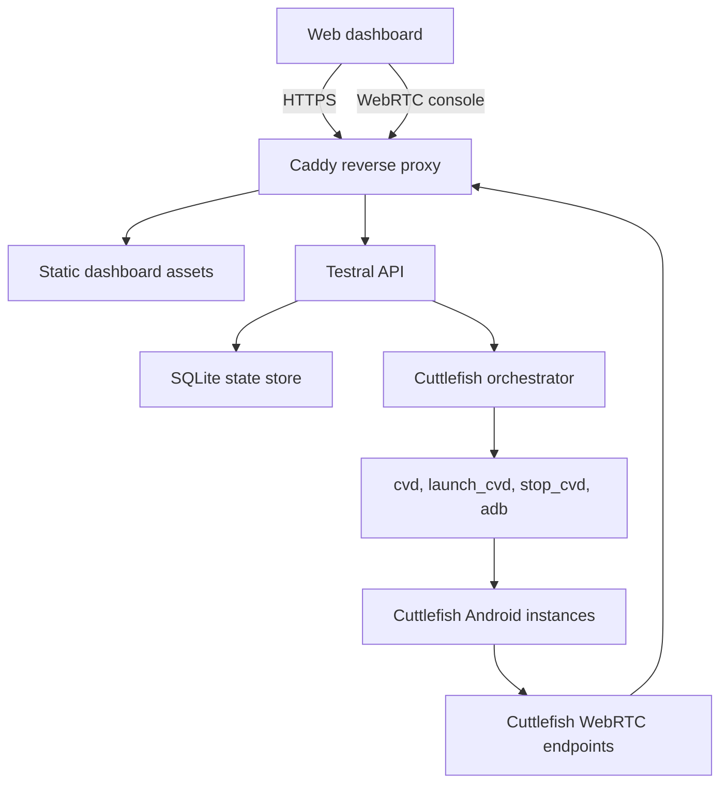

# Testral Architecture

Testral is a host-local control plane for Google Cuttlefish. The MVP treats
the Ubuntu Server VM as the only managed host and models every Android device as
a Cuttlefish instance owned by that host.

## System Context

## Core Components

### Dashboard

The frontend is a React application that combines:

- Google Cloud style summary cards, tables, and detail pages.
- vCenter style inventory navigation: host, images, instances, operations.
- Instance actions for start, stop, delete, and console open.
- A console route that embeds the Cuttlefish WebRTC endpoint exposed by the API.

### API Service

The backend is a Go service responsible for:

- Host capacity and prerequisite checks.
- Instance inventory and lifecycle state.
- Image registration.
- Operation history and audit-friendly event records.
- Cuttlefish command execution through a narrow adapter.
- WebRTC console URL discovery and reverse proxy friendly routing metadata.

### SQLite Store

SQLite is the MVP persistence layer because the product is scoped to one host.
The schema stores hosts, images, instances, operations, and lifecycle history.
The tables use stable identifiers so a future multi-host scheduler can reuse the
same resource model.

### Cuttlefish Orchestrator

The orchestrator converts API actions into host commands. Command execution is
kept behind an interface so unit tests can verify lifecycle behavior without
requiring Cuttlefish or KVM.

The MVP records the intended launch metadata and exposes dry-run behavior when
Cuttlefish tools are unavailable. On a prepared Ubuntu host, the adapter can run
real commands from the service process.

## Lifecycle Model

Instances use explicit lifecycle states:

- `provisioning`: the instance record exists and resources are being assigned.
- `starting`: Cuttlefish launch has been requested.
- `booting`: launch returned and Android boot readiness is being checked.
- `running`: the instance is reachable and the console endpoint is available.
- `stopping`: shutdown has been requested.
- `stopped`: no guest process is expected to be running.
- `error`: the last operation failed or readiness checks did not pass.
- `deleting`: cleanup is in progress.

The API stores an operation row for every lifecycle request. Operations make the
dashboard activity log useful and give later automation a durable place to resume
or reconcile state.

## WebRTC Console Path

Cuttlefish native WebRTC is the primary MVP console provider. Each instance
stores a `console_url` and `console_provider` value. The dashboard does not know
how Cuttlefish is launched; it only asks the API for the console metadata.

This keeps room for a later `ws-scrcpy` provider without changing the main
instance model.

## Networking Guardrails

- Public users should reach Testral only through HTTPS.
- ADB should bind locally and should not be exposed by the reverse proxy.
- WebSocket and WebRTC upgrade paths should be routed through the proxy.
- Host firewall rules should allow only the dashboard/proxy surface by default.

## Deployment Shape

The recommended MVP deployment is host-native:

- `opencuttles-api.service` runs the backend API.
- Caddy serves the frontend and proxies `/api`.
- Cuttlefish runs on the Ubuntu host with direct KVM access.
- Future per-instance systemd units can be introduced when process supervision
  needs to be stricter than the API orchestrator.

## Future Extensions

- Multi-host agents and a scheduler.
- ws-scrcpy console provider.
- RBAC and external identity providers.
- Image upload, validation, and garbage collection.
- Prometheus metrics and structured log export.
- Tenant networking isolation.
