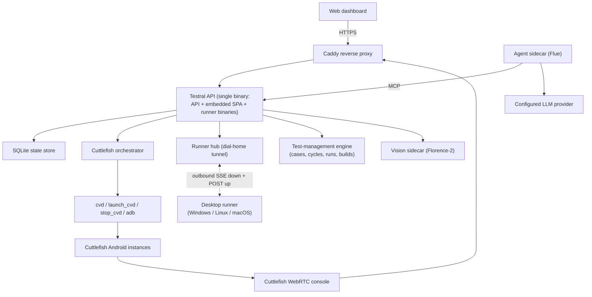

# Testral Architecture

Testral is a control plane for **agentic UI testing across operating systems**.
A local cognitive-core agent, grounded by a vision model, drives real devices in
natural language and runs replayable UI tests — on Android (Google Cuttlefish
VMs on the appliance) and on Windows/Linux/macOS desktops (via a dial-home
runner).

Everything runs on one Ubuntu Server appliance. The API, dashboard, and desktop
runner binaries ship as a **single Go binary**: the built frontend and the
per-OS runner executables are `go:embed`ed into it, so a deploy is one artifact.

## System Context

## Core Components

### API service (`backend/`)

One Go binary, `net/http` only, serving:

- The embedded dashboard SPA and the device-console proxy.
- The REST API: hosts, images, instances, operations, audit events.
- The **MCP endpoint** (`/api/v1/mcp`) — the tool surface the agent drives
  devices through (`tap_element`, `tap`, `click`, `press_chord`, `scroll`,
  `ask_screen`, `get_ui_tree`, …).
- The test-management engine and cron scheduler.
- The runner hub that desktop machines dial into.

### Dashboard (`frontend/`)

React 19 + Vite + Tailwind v4 + shadcn/ui, built and embedded into the binary.
Caddy does **not** serve static assets — it only terminates TLS and proxies
everything to `127.0.0.1:8080`.

### Agent sidecar (`agent/`)

A [Flue](https://flueframework.com)-harnessed TypeScript agent — the cognitive
core. It connects to the API's MCP endpoint as a client and drives devices in
natural language. Flue's built-in developer tools (fs/bash) are deliberately
suppressed: the agent gets device-control tools and nothing else.

The model is admin-configurable at runtime. The sidecar reads it, plus the
decrypted provider API key, from `GET /api/v1/agent/runtime`, authenticated with
`OPENCUTTLES_MCP_TOKEN`.

### Vision sidecar (`vision/`)

Florence-2 behind a small Python HTTP service. It grounds screenshots:

- `POST /point` — locate a described element. Text labels dominate Android UI,
  so it matches OCR regions first and falls back to open-vocabulary detection
  for icons.
- `POST /query` — Florence-2 has no free-form VQA head, so this returns a
  caption plus on-screen OCR for the caller to reason over. When a real answer
  is needed, `ask_screen` routes through the configured LLM instead.

Vision is the grounding engine for every agent test, so a dead sidecar means no
test can run — the health report probes it explicitly.

### Desktop runner (`runner/`)

A separate, **cgo-free** Go module so it cross-compiles to every desktop target
from the appliance. Its binaries are embedded in the API binary and downloadable
straight from the dashboard.

It **dials home** — SSE down for commands, POST up for results — so a machine
under test needs no inbound ports and no VPN. Each platform implements the same
controller interface natively: Win32 GDI capture + `user32` input, X11/xdotool,
AppleScript/cliclick. On Windows it installs as a login-start agent with a
system-tray presence and an install wizard.

Enrollment tokens are stored as sha256; the runner's own credential and stored
provider keys are encrypted at rest with `OPENCUTTLES_SECRET_KEY`
(AES-256-GCM via `internal/secretbox`).

### Test management

A QMetry-shaped model: **TestCase → TestCycle → CycleRun → per-case TestRun**.
Cycles run on cron (per-cycle timezone) or trigger on a new build upload. The
agent reports per-step outcomes back through the `report_step_result` MCP tool.

Results are classified from the actual step record rather than from "the agent
stopped", which is what prevents a crashed run from being recorded as a pass.
Evidence (per-step screenshots, session video) is written under
`OPENCUTTLES_ARTIFACT_ROOT` and pruned by a retention sweep. Exports are JUnit,
CSV, and XLSX; completion fires a generic webhook.

### SQLite store

One host, one database — `modernc.org/sqlite`, no cgo.

Connection settings (`busy_timeout`, `foreign_keys`, WAL, `synchronous`) are DSN
`_pragma` parameters, not post-open `Exec` calls: the pool may retire and reopen
a connection at any time, and a replacement would otherwise come up with foreign
keys off.

`SetMaxOpenConns(1)` serializes writes and keeps the store simple. It is also the
reason `/healthz` must actually ping the database — one stuck query wedges every
handler, and a constant-`ok` probe would report green throughout.

## Lifecycle model

Instances use explicit states: `provisioning`, `starting`, `booting`, `running`,
`stopping`, `stopped`, `error`, `deleting`.

Every lifecycle request writes an operation row. Nothing resumes across a
restart, so boot performs two sweeps:

- `orchestrator.Reconcile` moves instances stranded mid-transition to `error`.
- `FailStrandedCycleRuns` marks cycle runs left `running` as failed. This is not
  cosmetic: due-cycle selection skips any cycle with a run in flight, so a
  restart during a scheduled run would otherwise disable that schedule
  permanently and silently.

## Security model

- Sessions are cookie-based; passwords are PBKDF2-SHA256. RBAC roles are admin,
  operator, viewer, and are OIDC-ready.
- `OPENCUTTLES_MCP_TOKEN`, `OPENCUTTLES_BOOTSTRAP_TOKEN`, and
  `OPENCUTTLES_SECRET_KEY` are generated at install time by
  `scripts/ubuntu/ensure-secrets.sh` and ship **empty**, so a missed generation
  fails closed instead of installing a publicly known credential.
- Rate limiting keys on the client host with the port stripped. Behind a trusted
  proxy it takes the **last** `X-Forwarded-For` element — the one our own Caddy
  appended — because leading entries are attacker-controlled.
- Image paths are confined to the image root before any recursive delete.
- Upload bodies are bounded by `MaxBytesReader`; `ParseMultipartForm`'s argument
  is only the in-memory buffer and does not cap the request.

## Networking guardrails

- Reach Testral only through HTTPS in production.
- ADB binds locally and is never exposed by the proxy.
- Desktop runners connect **outbound only** — no inbound ports on machines
  under test.
- Host firewall allows only the dashboard/proxy surface by default.

## Deployment shape

- `opencuttles-api.service` runs the binary. `KillMode=process` so a restart
  does not SIGKILL the Cuttlefish AVDs living in its cgroup — the API reconnects
  over ADB instead.
- `opencuttles-agent.service` and `opencuttles-vision.service` run the sidecars.
- `opencuttles-backup.timer` snapshots nightly.
- Caddy terminates TLS and proxies to `127.0.0.1:8080`.
- Cuttlefish runs on the host with direct KVM access.

## Known limitations

- `SetMaxOpenConns(1)` means one slow query serializes the API.
- Runner enrollment tokens do not expire and have no revocation path.
- Row-level growth (audit events, step records) is not yet pruned or VACUUMed;
  only on-disk artifacts are.

## Future extensions

- Multi-host agents and a scheduler.
- ws-scrcpy console provider.
- External identity providers (the RBAC model is already OIDC-shaped).
- Image upload and validation (deletion and GC now exist).
- Tenant networking isolation.
